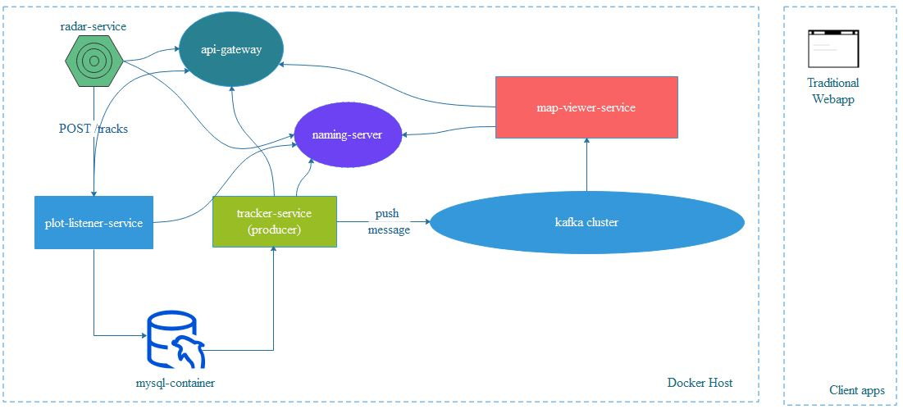

# radar-tracking-system
[linkedin-shield]: https://img.shields.io/badge/-LinkedIn-black.svg?style=flat-square&logo=linkedin&colorB=555
[linkedin-url]: https://linkedin.com/in/boraciner
[![LinkedIn][linkedin-shield]][linkedin-url]

<!-- PROJECT LOGO -->
 

    
    
    <h3 align="center">Microservices in radar track extraction</h3>

    Spring Boot Applications
     
-   radar-service: generating 2D plot data for 5 tracks with respect to 2nd degree of polynomial function 
-   plot-listener-service: listens plots from any source and writes to Msql DB 
Endpoint: 
POST /tracks (port : 8100) 
-   tracker-service: retrieves the plot data and generates tracks by running kalman or other tracker filters 

  

