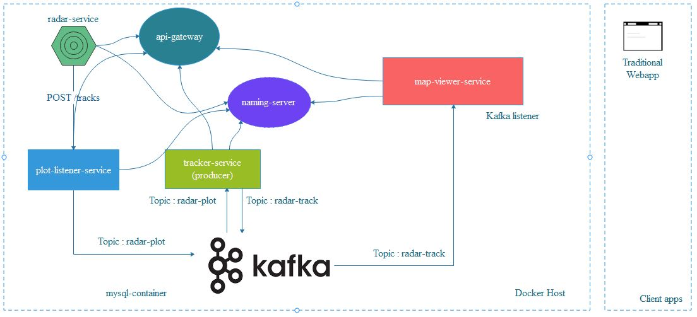
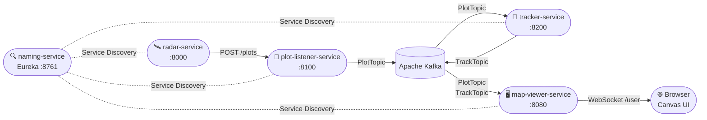

<div align="center">

# 🎯 Radar Tracking System

**Real-time multi-target tracking with Kalman filtering over a microservices pipeline**

[](https://openjdk.org/projects/jdk/21/)
[](https://spring.io/projects/spring-boot)
[](https://spring.io/projects/spring-cloud)
[](https://kafka.apache.org/)
[](https://docs.docker.com/compose/)
[](https://linkedin.com/in/boraciner)



> Simulate radar sensors → stream plots through Kafka → filter with a Kalman tracker → watch everything live on a canvas radar scope.

</div>

---

## ✨ What It Does

Three synthetic radar targets move across the screen simultaneously. Each target generates noisy position measurements every second. A Kalman filter tracker picks up those measurements, associates them to the right targets, and produces clean smoothed tracks. A WebSocket-powered canvas UI lets you toggle between the raw plots, the ground truth, and the filtered tracks — all in real time.

---

## 🏗️ Architecture


```mermaid
flowchart LR
    RS([🛰️ radar-service\n:8000])
    PL([📡 plot-listener-service\n:8100])
    KF([🧮 tracker-service\n:8200])
    MV([🖥️ map-viewer-service\n:8080])
    EU([🔍 naming-service\nEureka :8761])
    K[(Apache Kafka)]
    BR([🌐 Browser\nCanvas UI])

    RS -- "POST /plots" --> PL
    PL -- "PlotTopic" --> K
    K -- "PlotTopic" --> KF
    KF -- "TrackTopic" --> K
    K -- "PlotTopic\nTrackTopic" --> MV
    MV -- "WebSocket /user" --> BR
    EU -. "Service Discovery" .- RS & PL & KF & MV
```

---

## 🧩 Services

| Service | Port | Description |
|:--------|:----:|:------------|
| `naming-service` | **8761** | Eureka service registry — all services register here |
| `radar-service` | **8000** | Generates 3 independent targets every second with Gaussian noise (σ = 0.15) |
| `plot-listener-service` | **8100** | Receives plots via REST, publishes to Kafka `PlotTopic` |
| `tracker-service` | **8200** | Runs the Kalman filter, publishes confirmed tracks to `TrackTopic` |
| `map-viewer-service` | **8080** | Kafka consumer + WebSocket server + canvas radar scope |

---

## 🔬 Kalman Filter Tracker

The tracker uses a **2D constant-velocity model** with nearest-neighbour data association.

**State vector:** `[ x, y, vx, vy ]`

**State transition (dt = 1s):**
```
F = | 1  0  dt  0 |      H = | 1  0  0  0 |
    | 0  1   0 dt |          | 0  1  0  0 |
    | 0  0   1  0 |
    | 0  0   0  1 |
```

**Noise parameters:**
- Process noise σ_a = `0.5 m/s²`
- Measurement noise σ_r = `0.15` (matches radar simulation)
- Association gate = `2.0 units` Euclidean distance

**Track lifecycle:**

```
New plot  ──►  TENTATIVE  ──( 3 hits )──►  CONFIRMED  ──( 5 misses )──►  DELETED
                  │                              │
               not yet                    published to
               published                   TrackTopic
```

---

## 📡 Simulated Targets

| Target | Trajectory | Starting X |
|:------:|:-----------|:----------:|
| **1** | Parabola &nbsp;`y = 0.3·(x−5)² + 0.5` | 0.0 |
| **2** | Diagonal line &nbsp;`y = 0.7·x + 1.0` | 3.0 |
| **3** | Sinusoid &nbsp;`y = 5.0 + 3.5·sin(0.9x)` | 6.0 |

Each target sweeps `x = 0 → 10` (step 0.2/s), then wraps back to 0 for continuous operation.

---

## 🖥️ Radar Scope UI

Open **`http://localhost:8080`** after starting all services.

<table>
<tr>
<td width="50%">

**Three toggleable layers:**

| Symbol | Layer | Colour |
|:------:|:------|:-------|
| `×` | Raw plots (noisy) | Yellow / Cyan / Green per target |
| `▲` | Ground truth | Same target colour |
| `○` | Kalman tracks | Blue palette per track ID |

</td>
<td width="50%">

**Side panel shows:**
- Active track count
- Live `x / y / vx / vy` per track
- Target colour legend
- Connection status badge

</td>
</tr>
</table>

All layers render fading history trails. The canvas redraws at 60 fps via `requestAnimationFrame`. WebSocket auto-reconnects on drop.

---

## 📨 Kafka Topics

| Topic | Producer | Consumers |
|:------|:---------|:----------|
| `PlotTopic` | `plot-listener-service` | `tracker-service`, `map-viewer-service` |
| `TrackTopic` | `tracker-service` | `map-viewer-service` |

---

## 🚀 Quick Start

**Prerequisites:** Java 21, Maven, Docker

### 1 — Start Kafka

```bash
docker-compose up -d
```

### 2 — Start all services

```bash
# Windows — opens a separate terminal window per service
start-all.bat
```

Or manually, **in this order**:

```bash
# Eureka first
cd naming-service        && mvn spring-boot:run

# Then these three (order doesn't matter much)
cd plot-listener-service && mvn spring-boot:run
cd tracker-service       && mvn spring-boot:run
cd map-viewer-service    && mvn spring-boot:run

# Radar last — pipeline must be ready to receive plots
cd radar-service         && mvn spring-boot:run
```

### 3 — Open the UI

| URL | Page |
|:----|:-----|
| `http://localhost:8080` | 🎯 Live radar scope |
| `http://localhost:8761` | 🔍 Eureka dashboard |

---

## 📁 Project Structure

```
radar-tracking-system/
├── naming-service/          # Eureka server
├── radar-service/           # Target simulator
├── plot-listener-service/   # REST → Kafka bridge
├── tracker-service/
│   ├── KalmanFilter.java    # Filter math (commons-math3)
│   ├── TrackedObject.java   # Per-track state machine
│   └── TrackManager.java    # Association + lifecycle
├── map-viewer-service/
│   ├── kafka/               # Kafka consumers + WebSocket broadcast
│   ├── static/index.html    # Canvas UI layout
│   └── static/app.js        # Rendering engine + WS client
├── docker-compose.yml       # Kafka + Zookeeper
└── start-all.bat            # One-click launcher
```

---

<div align="center">

Built with ☕ and a bit of signal processing

[](https://linkedin.com/in/boraciner)

</div>
