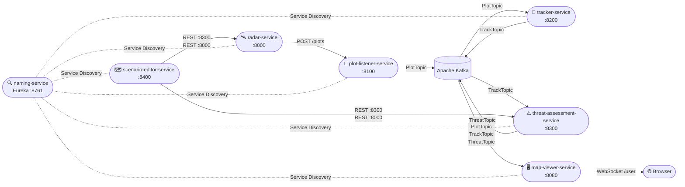

<div align="center">

# 🎯 Radar Tracking System

**Real-time multi-target tracking, threat assessment, ECM simulation and scenario editing over a microservices pipeline**

[](https://openjdk.org/projects/jdk/21/)
[](https://spring.io/projects/spring-boot)
[](https://spring.io/projects/spring-cloud)
[](https://kafka.apache.org/)
[](https://docs.docker.com/compose/)
[](https://linkedin.com/in/boraciner)

> Simulate radar sensors → stream plots through Kafka → filter with a Kalman tracker → assess threats → visualise everything live on a canvas radar scope.

</div>

---

## ✨ What It Does

Three synthetic radar targets move across the screen simultaneously. Each target generates noisy position measurements every second. A Kalman filter tracker associates measurements to targets and produces clean smoothed tracks. A threat assessment engine scores each track for proximity and closing speed against a defended asset, classifies it (FRIENDLY → HOSTILE), and colours the radar scope accordingly. An IFF zone system lets you designate friendly, restricted and hostile airspace. A scenario editor UI lets you reposition the asset, paint IFF zones and inject ECM jamming modes — all without restarting anything.

---

## 🏗️ Architecture


```mermaid
flowchart LR
    RS([🛰️ radar-service\n:8000])
    PL([📡 plot-listener-service\n:8100])
    KF([🧮 tracker-service\n:8200])
    TA([⚠️ threat-assessment-service\n:8300])
    MV([🖥️ map-viewer-service\n:8080])
    SE([🗺️ scenario-editor-service\n:8400])
    EU([🔍 naming-service\nEureka :8761])
    K[(Apache Kafka)]
    BR([🌐 Browser])

    RS -- "POST /plots" --> PL
    PL -- "PlotTopic" --> K
    K -- "PlotTopic" --> KF
    KF -- "TrackTopic" --> K
    K -- "TrackTopic" --> TA
    TA -- "ThreatTopic" --> K
    K -- "PlotTopic\nTrackTopic\nThreatTopic" --> MV
    MV -- "WebSocket /user" --> BR
    SE -- "REST :8300\nREST :8000" --> TA & RS
    EU -. "Service Discovery" .- RS & PL & KF & TA & MV & SE
```

---

## 🧩 Services

| Service | Port | Description |
|:--------|:----:|:------------|
| `naming-service` | **8761** | Eureka service registry |
| `radar-service` | **8000** | Target simulator with ECM injection (NONE / BARRAGE / SPOT / DRFM) |
| `plot-listener-service` | **8100** | REST → Kafka bridge, publishes to `PlotTopic` |
| `tracker-service` | **8200** | Kalman filter + track lifecycle, publishes to `TrackTopic` |
| `threat-assessment-service` | **8300** | Threat scoring engine, IFF zone registry, asset position, publishes to `ThreatTopic` |
| `map-viewer-service` | **8080** | Kafka consumer + WebSocket server + live canvas radar scope |
| `scenario-editor-service` | **8400** | Canvas UI to place asset, paint IFF zones, switch ECM mode |

---

## 🔬 Kalman Filter Tracker

The tracker uses a **2D constant-velocity model** with nearest-neighbour data association.

**State vector:** `[ x, y, vx, vy ]`

**State transition (dt = 1s):**
```
F = | 1  0  dt  0 |      H = | 1  0  0  0 |
    | 0  1   0 dt |          | 0  1  0  0 |
    | 0  0   1  0 |
    | 0  0   0  1 |
```

**Noise parameters:**
- Process noise σ_a = `0.5 m/s²`
- Measurement noise σ_r = `0.15` (matches radar simulation)
- Association gate = `2.0 units` Euclidean distance

**Track lifecycle:**

```
New plot  ──►  TENTATIVE  ──( 3 hits )──►  CONFIRMED  ──( 5 misses )──►  DELETED
                  │                              │
               not yet                    published to
               published                   TrackTopic
```

---

## ⚠️ Threat Assessment Engine

Each confirmed track is scored against the **defended asset** (default position 5, 5) on two components:

| Component | Weight (approaching) | Formula |
|:----------|:-----:|:--------|
| Distance | 40 % | `1 − dist / MAX_RANGE` |
| Closing speed | 60 % | `clamp(closing / 3.0, 0, 1)` |

Tracks moving away use distance-only scoring (weight 30 %).

**Threat levels:**

| Score | Level | Colour |
|:-----:|:------|:-------|
| < 0.20 | NEUTRAL | Grey |
| < 0.40 | UNKNOWN | Yellow |
| < 0.65 | SUSPECT | Orange |
| ≥ 0.65 | HOSTILE | Red |

IFF zone membership overrides the score: a track inside a **FRIENDLY** zone → `FRIENDLY`; inside a **RESTRICTED** zone → `SUSPECT`; inside a **HOSTILE** zone → `HOSTILE`.

---

## 🛡️ IFF Zones

Zones are managed via REST (`threat-assessment-service :8300`):

| Method | Path | Description |
|:-------|:-----|:------------|
| `GET` | `/iff-zones` | List all zones |
| `POST` | `/iff-zones` | Create a zone (name, centerX/Y, radius, type) |
| `DELETE` | `/iff-zones/{id}` | Remove a zone |
| `GET` | `/asset` | Get defended asset position |
| `POST` | `/asset` | Move defended asset |

Zone types: **FRIENDLY** (green), **RESTRICTED** (yellow), **HOSTILE** (red).

---

## 📡 ECM Simulation

ECM mode is set via `radar-service :8000`:

| Mode | Effect |
|:-----|:-------|
| `NONE` | Normal σ = 0.15 |
| `BARRAGE` | σ = 0.75 + 0–2 random false alarms per cycle |
| `SPOT` | Drops all plots with `trueX < 4.0` (blind sector) |
| `DRFM` | Injects 1–2 ghost copies per plot at ±0.6 random offset |

Switch mode via the Scenario Editor or `POST /ecm {"mode": "BARRAGE"}`.

---

## 📡 Simulated Targets

| Target | Trajectory | Starting X |
|:------:|:-----------|:----------:|
| **1** | Parabola &nbsp;`y = 0.3·(x−5)² + 0.5` | 0.0 |
| **2** | Diagonal line &nbsp;`y = 0.7·x + 1.0` | 3.0 |
| **3** | Sinusoid &nbsp;`y = 5.0 + 3.5·sin(0.9x)` | 6.0 |

Each target sweeps `x = 0 → 10` (step 0.2/s), then wraps back to 0 for continuous operation.

---

## 🖥️ Radar Scope UI

Open **`http://localhost:8080`** after starting all services.

| Layer | Symbol | Description |
|:------|:------:|:------------|
| Raw Plots | `×` | Noisy measurements, coloured per target |
| Ground Truth | `▲` | True positions, same target colour |
| Kalman Tracks | `○` | Filtered tracks, coloured by threat level |
| IFF Zones | `⬤` | Coloured circles (FRIENDLY/RESTRICTED/HOSTILE) |
| Defended Asset | `★` | Pulsing star at asset position |

Side panel shows:
- Active track count and total plot count
- Threat summary (counts per level)
- Per-track list with threat level and distance-to-asset
- IFF zone list
- ECM mode badge

WebSocket auto-reconnects. ECM / zone / asset state auto-refreshes every 5 s.

---

## 🗺️ Scenario Editor

Open **`http://localhost:8400`** to edit the live scenario.

- **Place Asset** — click anywhere on the canvas to move the defended asset
- **Add IFF Zone** — click to place a named zone (set name, radius and type in the form)
- **Delete Zone** — click the × button in the zone list
- **ECM Mode** — select NONE / BARRAGE / SPOT / DRFM and click Apply

Changes take effect immediately — the radar scope and threat assessor pick them up within seconds.

---

## 📨 Kafka Topics

| Topic | Producer | Consumers |
|:------|:---------|:----------|
| `PlotTopic` | `plot-listener-service` | `tracker-service`, `map-viewer-service` |
| `TrackTopic` | `tracker-service` | `threat-assessment-service`, `map-viewer-service` |
| `ThreatTopic` | `threat-assessment-service` | `map-viewer-service` |

---

## 🚀 Quick Start

**Prerequisites:** Java 21, Docker

### 1 — Start Kafka

```bash
docker-compose up -d
```

### 2 — Start all services

```bash
# Windows — opens a separate terminal window per service
start-all.bat
```

Or manually with Gradle, **in this order**:

```bash
./gradlew :naming-service:bootRun            # Eureka first
./gradlew :plot-listener-service:bootRun
./gradlew :tracker-service:bootRun
./gradlew :threat-assessment-service:bootRun
./gradlew :map-viewer-service:bootRun
./gradlew :scenario-editor-service:bootRun
./gradlew :radar-service:bootRun             # Radar last
```

### 3 — Open the UIs

| URL | Page |
|:----|:-----|
| `http://localhost:8080` | 🎯 Live radar scope |
| `http://localhost:8400` | 🗺️ Scenario editor |
| `http://localhost:8761` | 🔍 Eureka dashboard |

---

## 📁 Project Structure

```
radar-tracking-system/
├── naming-service/
├── radar-service/              # ECM: EcmMode, EcmState, EcmController
├── plot-listener-service/
├── tracker-service/
│   ├── KalmanFilter.java
│   ├── TrackedObject.java
│   └── TrackManager.java
├── threat-assessment-service/  # NEW
│   ├── model/                  # ThreatLevel, IffZone, ThreatAssessment, AssetPosition
│   ├── service/                # ThreatAssessor, IffZoneRegistry
│   ├── kafka/                  # TrackConsumer, ThreatProducerService
│   └── controller/             # IffZoneController, AssetController
├── map-viewer-service/
│   ├── kafka/                  # Plot, Track, ThreatAssessment consumers → WebSocket
│   ├── static/index.html       # Canvas UI with threat/zone/ECM panels
│   └── static/app.js           # Rendering engine + WS client
├── scenario-editor-service/    # NEW
│   └── static/                 # index.html + app.js (canvas editor)
├── gradle/libs.versions.toml   # Shared version catalog
├── docker-compose.yml
└── start-all.bat               # One-click launcher (7 services)
```

---

## 🛠️ Useful Gradle Tasks

```bash
./gradlew build                    # compile + test all 7 services
./gradlew checkVersions            # check for dependency updates
./gradlew :service-name:bootRun    # start a single service
```

---

<div align="center">

Built with ☕ and a bit of signal processing

[](https://linkedin.com/in/boraciner)

</div>
