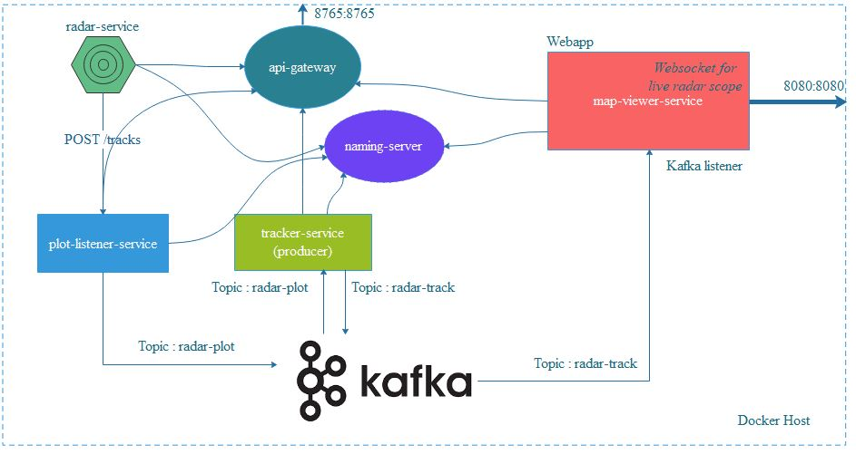

# radar-tracking-system
[linkedin-shield]: https://img.shields.io/badge/-LinkedIn-black.svg?style=flat-square&logo=linkedin&colorB=555
[linkedin-url]: https://linkedin.com/in/boraciner
[![LinkedIn][linkedin-shield]][linkedin-url]

<!-- PROJECT LOGO -->
 

    
    
    <h3 align="center">Microservices in radar track extraction</h3>

    Spring Boot Applications
     
-   naming-service (8761): Eureka Server
-   radar-service (8000): generating 2D plot data for 5 tracks with respect to 2nd degree of polynomial function 
-   plot-listener-service (8100): listens plots from any source and publishes to Kafka topic : radar-plot cluster 
Endpoint: 
POST /tracks 
-   tracker-service (8200): listens plot data from radar-plot kafka topic and publishes tracks to radar-track topic by running kalman or other tracker filters 
-   map-viewer-service (8080) : listens the track data from radar-track topic and displays them in a radar scope by using Websocket to update them dynamically.
  

